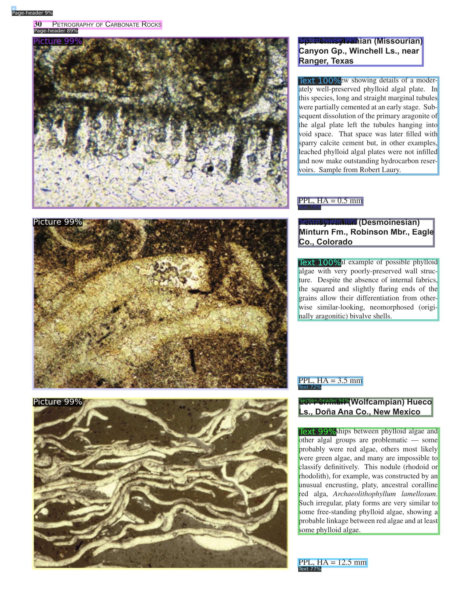

# Tormenta #
PDF Image and text extraction, we use [VGT](https://github.com/AlibabaResearch/AdvancedLiterateMachinery/tree/main/DocumentUnderstanding/VGT) to analyze the page layout generating bounding boxes for each page element. 
Then different tools are used to extract both images and texts from each page.



Both the content and bounding boxes are 
structured in a .xml as shown in the following example.    

```
<output>
  <page number="0">
    <item block="0" type="text" subtype="Text" x0="538" y0="1090" x1="1575" y1="1160">Director, New Mexico Bureau of Geology and Mineral Resources, new Mexico Institute of Mining &amp; Technology, Socorro, NM 87801</item>
    <item block="1" type="text" subtype="Text" x0="539" y0="1287" x1="1493" y1="1361">Senior Research Scientist, New Mexico Institute of Mining &amp; Technology, Socorro, NM 87801</item>
    <item block="2" type="image" subtype="" x0="874" y0="2002" x1="990" y1="2044">result/test/AAPG Memoir 77_Colour Guide to the Petrography of Carbonate Rocks_Schole &amp; Schole_2003/cropped_image/page_0_box2.png</item>
    <item block="3" type="image" subtype="" x0="469" y0="1562" x1="924" y1="1615">result/test/AAPG Memoir 77_Colour Guide to the Petrography of Carbonate Rocks_Schole &amp; Schole_2003/cropped_image/page_0_box3.png</item>
    <item block="4" type="text" subtype="Text" x0="327" y0="1856" x1="1542" y1="1968">The American Association of Petroleum Geologists Tulsa, Oklahoma, U.S.A.</item>
    <item block="5" type="image" subtype="" x0="527" y0="1015" x1="904" y1="1066">result/test/AAPG Memoir 77_Colour Guide to the Petrography of Carbonate Rocks_Schole &amp; Schole_2003/cropped_image/page_0_box5.png</item>
    <item block="6" type="image" subtype="" x0="525" y0="1216" x1="1060" y1="1265">result/test/AAPG Memoir 77_Colour Guide to the Petrography of Carbonate Rocks_Schole &amp; Schole_2003/cropped_image/page_0_box6.png</item>
    <item block="7" type="text" subtype="Section-header" x0="114" y0="248" x1="1600" y1="687">Petrography of Carbonate Rocks: Grains, textures, porosity, diagenesis</item>
    <item block="8" type="image" subtype="" x0="169" y0="848" x1="1622" y1="2105">result/test/AAPG Memoir 77_Colour Guide to the Petrography of Carbonate Rocks_Schole &amp; Schole_2003/cropped_image/page_0_box8.png</item>
  </page>
  <page number="1">
  .
  .
  .
```

## Installation ##

1. Download [VGT](https://github.com/AlibabaResearch/AdvancedLiterateMachinery/tree/main/DocumentUnderstanding/VGT). 
    ```angular2html
    git clone https://github.com/AlibabaResearch/AdvancedLiterateMachinery.git
    mv AdvancedLiterateMachinery/DocumentUnderstanding/VGT/ VGT/
    rm -r AdvancedLiterateMachinery/
    ```

2. Download pre trained model.
    ```angular2html
    wget https://github.com/AlibabaResearch/AdvancedLiterateMachinery/releases/download/v1.3.0-VGT-release/doclaynet_VGT_model.pth
    mkdir -p weights/vgt
    mv doclaynet_VGT_model.pth weights/vgt
    ```

3. Download [LayoutLM](https://huggingface.co/microsoft/layoutlm-base-uncased) required to run VGT
    ```angular2html
    git clone https://huggingface.co/microsoft/layoutlm-base-uncased
    ```

4. Install dependencies
   ```angular2html
   pip install -r requirements.txt
   curl -s https://packagecloud.io/install/repositories/github/git-lfs/script.deb.sh | sudo bash
   sudo apt-get install git-lfs
   ```
5. Build Detectron2 from source
   ```angular2html
   python -m pip install 'git+https://github.com/facebookresearch/detectron2.git'
   ```

6. Build MMOCR from source
   ```angular2html
   pip install -U openmim
   mim install mmengine
   mim install mmcv
   git clone https://github.com/open-mmlab/mmocr.git
   cd mmocr
   mim install -e .
   ``` 
   If you got a message like the following, check if your $CUDA_HOME variable is pointing to the correct path.
   MMCV searches for nvcc at $CUDA_HOME/bin/nvcc.
   ```angular2html
   error: [Errno 2] No such file or directory: '/root/anaconda3/envs/tormenta/bin/nvcc'
   ``` 

## Usage ##
Native PDFs
   ````angular2html
   python multiple_inference.py --grid pdfplumber --ocr mupdf --root path/to/pdfs/dir
   ````

Scanned PDFs
   ````angular2html
   python multiple_inference.py --grid mmocr --ocr tesseract --root path/to/pdfs/dir
   ````
